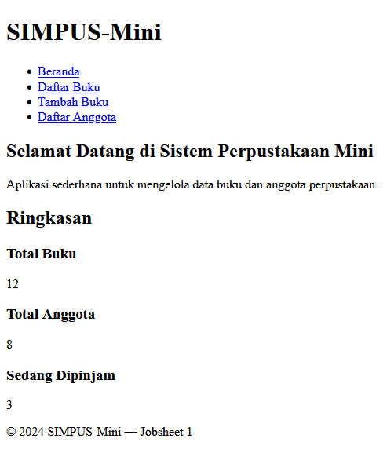
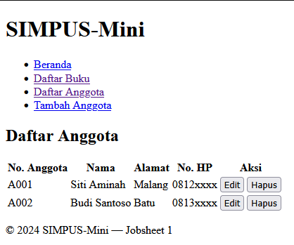

# Laporan Praktikum Jobsheet 1: Struktur Dasar HTML5

## Identitas Praktikan
| Keterangan | Isi |
| :--- | :--- |
| Nama | Marvelino Husca |
| Kelas | TI 2D |
| NIM | 254107020184 |
| No Absen | 14 |
| Program Studi | D4 Teknik Informatika |

---

## 1. Penjelasan Singkat
Praktikum ini berfokus pada pembuatan kerangka dasar halaman web statis (SIMPUS-MINI) menggunakan tag semantik HTML5 seperti `<header>`, `<nav>`, `<main>`, `<section>`, `<article>`, dan `<footer>`. Struktur folder dibagi menjadi entitas `buku` dan `anggota` untuk mempermudah manajemen *file*, dengan memanfaatkan *relative path* (`../`) untuk penghubungan navigasi antar halaman.

## 2. Screenshot Hasil per Halaman

* **Halaman Beranda (`index.html`)**
  Menampilkan struktur navigasi utama dan ringkasan data statis.

  

* **Halaman Daftar Buku (`buku/list.html`)**
  Menampilkan data perpustakaan menggunakan elemen `<table>` dengan `<thead>` dan `<tbody>`.

  

* **Halaman Tambah Buku (`buku/tambah.html`)**
  Menggunakan elemen `<form>` dan tag input untuk menambahkan data buku

  

* **Halaman List Anggota (`anggota/list.html`)**
  Menampilkan data anggota menggunakan elemen `<table>` dengan `<thead>` dan `<tbody>`.
  
  

* **Halaman Form Tambah Anggota (`anggota/tambah.html`)**
  Menggunakan elemen `<form>` dan tag input dasar untuk menambahkan data buku.
  
  

## Tambahan
1 Konsistensi Menu: Menambahkan tautan "Daftar Anggota" dan "Tambah Anggota" ke menu `<nav>` secara menyeluruh di halaman index.html, buku/list.html, dan buku/tambah.html.

2. Pada halaman anggota/tambah.html, tambahkan field "Program Studi" menggunakan tag `<select>` dan `<option>`.

