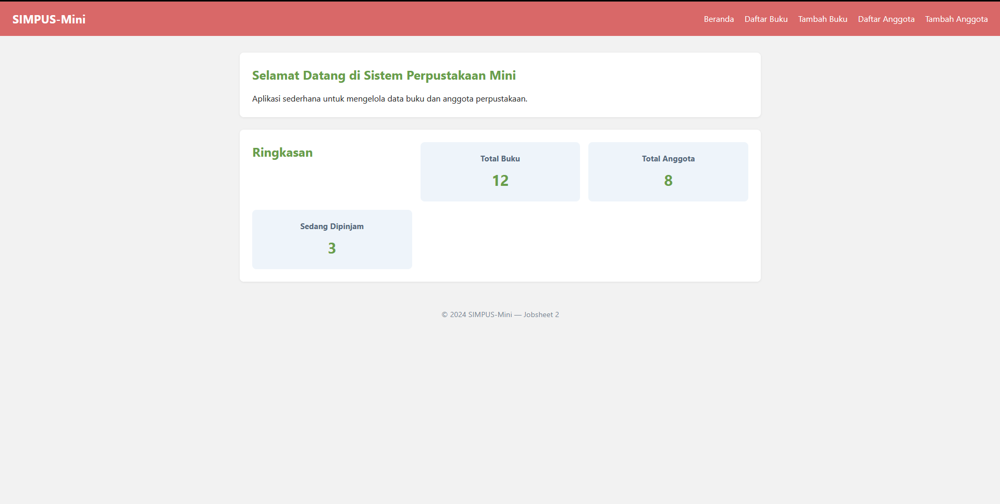
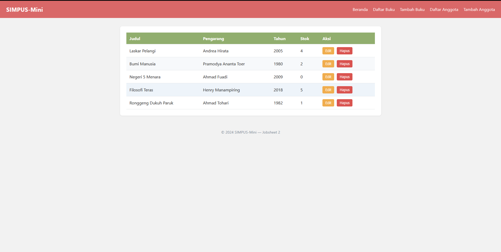
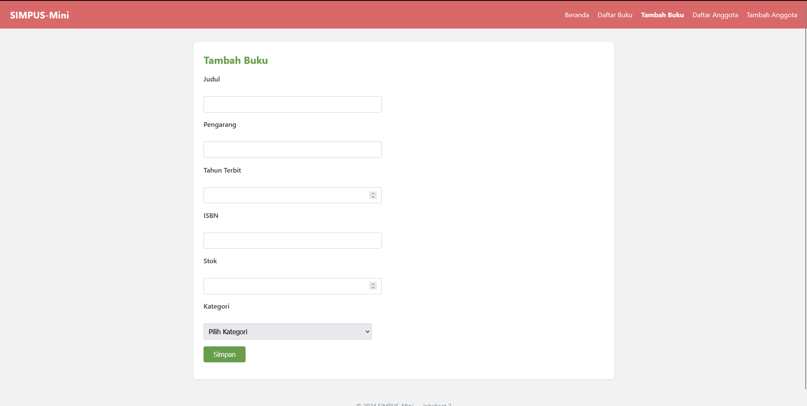
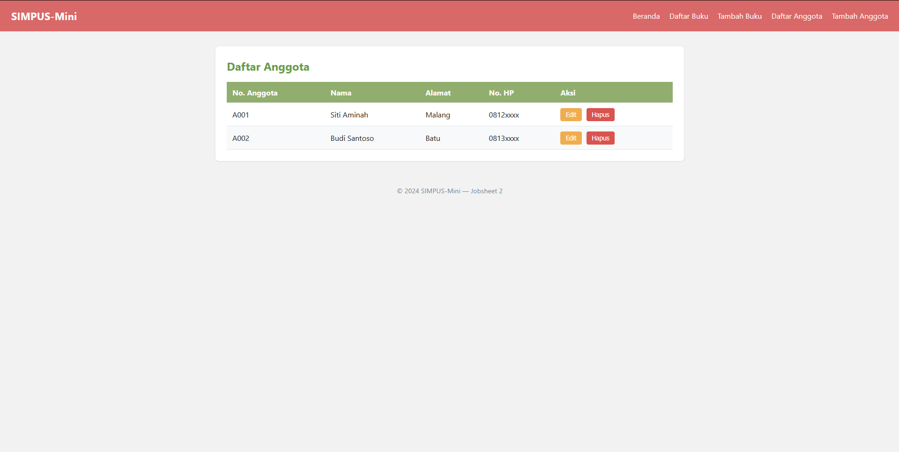
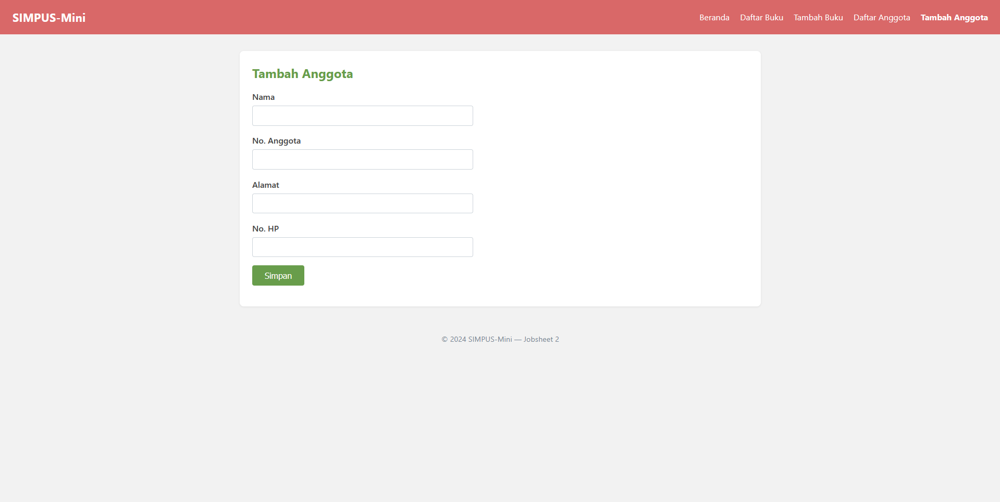
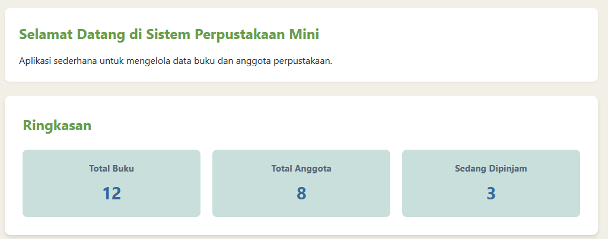
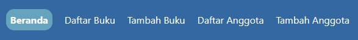

# Laporan Praktikum Jobsheet 2: Implementasi CSS Layout & Styling

## Identitas Praktikan
| Keterangan | Isi |
| :--- | :--- |
| Nama | Marvelino Husca |
| Kelas | TI 2D |
| NIM | 254107020184 |
| No Absen | 14 |
| Program Studi | D4 Teknik Informatika |

---

## 1. Penjelasan Singkat
Praktikum ini berfokus pada penerapan *Cascading Style Sheets* (CSS) secara eksternal (`style.css`) untuk mengatur presentasi visual kerangka HTML yang dibuat di Jobsheet 1. CSS digunakan untuk merapikan tata letak komponen menggunakan sistem antarmuka berbasis Grid dan memanipulasi warna untuk kenyamanan visual (UI/UX).

## 2. Screenshot Hasil per Halaman

* **Halaman Beranda dengan Grid Layout**
  Tata letak *card* ringkasan sekarang sejajar dalam satu baris.

  

* **Halaman Daftar Buku (`buku/list.html`)**
  Menampilkan data perpustakaan menggunakan elemen `<table>` dengan `<thead>` dan `<tbody>`.
  
  

* **Halaman Tambah Buku (`buku/tambah.html`)**
  Menggunakan elemen `<form>` dan tag input untuk menambahkan data buku
  
  

* **Halaman List Anggota (`anggota/list.html`)**
  Menampilkan data anggota menggunakan elemen `<table>` dengan `<thead>` dan `<tbody>`.

  

* **Halaman Form Tambah Anggota (`anggota/tambah.html`)**
  Menggunakan elemen `<form>` dan tag input dasar untuk menambahkan data buku.

  

## 3. Latihan Tambahan & Penjelasan (Modifikasi CSS)

1. **Tata Letak Kartu Statistik dengan CSS Grid:**
   * **Penjelasan:** Menggunakan properti `display: grid; grid-template-columns: repeat(3, 1fr);` pada elemen pembungkus `<section>`. Untuk elemen judul `<h2>Ringkasan</h2>`, diterapkan perintah `grid-column: 1 / -1;` agar elemen tersebut membentang mengambil ruang satu baris penuh di bagian atas, membiarkan ketiga kartu sejajar dengan rapi di bawahnya.

    

2. **Penanda Menu Aktif (Class `.active`):**
   * **Penjelasan:** Menambahkan kelas spesifik pada elemen tautan `<a>` di file HTML, dan memberikan warna sorot tebal di file CSS untuk menandakan halaman apa yang sedang dibuka oleh pengguna.

    