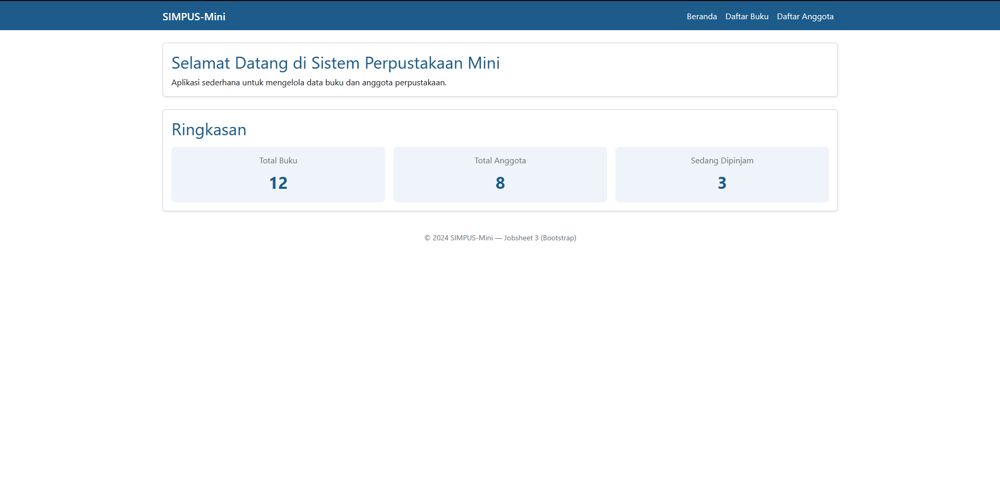
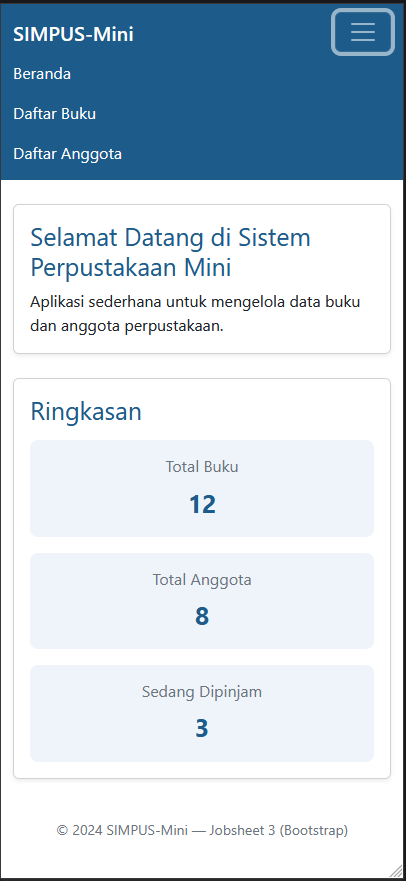
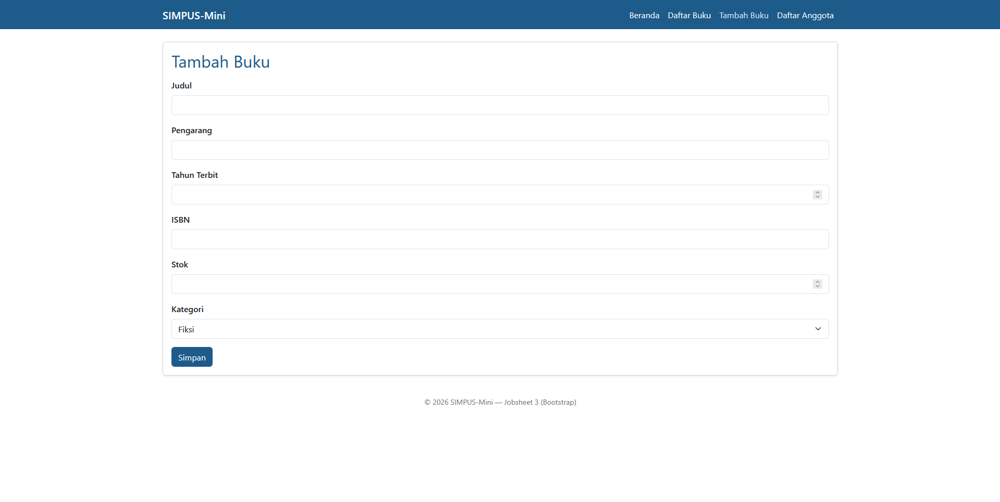
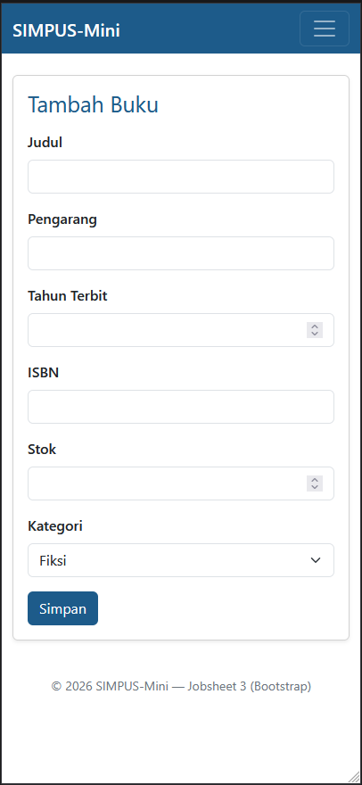
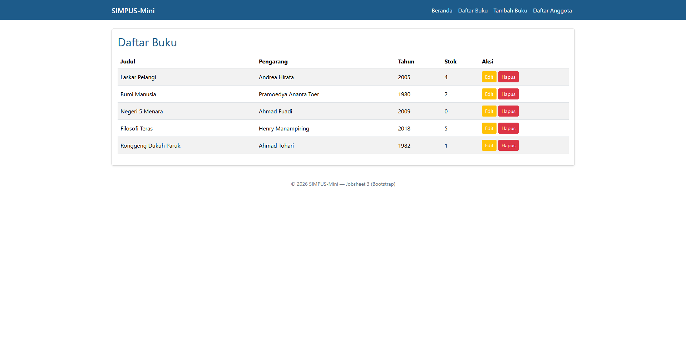
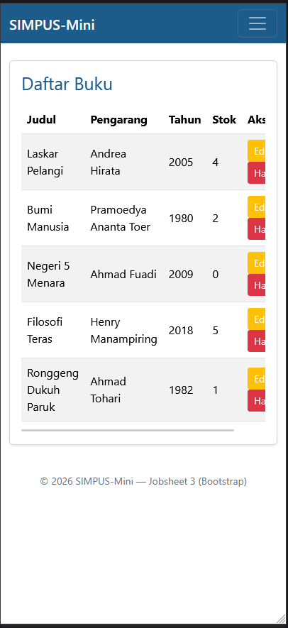

# Laporan Praktikum Jobsheet 3-Bootstrap: Responsive Design dengan Framework

## Identitas Praktikan
| Keterangan | Isi |
| :--- | :--- |
| Nama | Marvelino Husca |
| Kelas | TI 1H |
| NIM | 254107020184 |
| No Absen | 14 |
| Program Studi | D4 Teknik Informatika |

---

## 1. Penjelasan Singkat
Praktikum ini berfokus pada implementasi Responsive Design dimana website akan mengikuti lebar tampilan device pengguna. Ada tiga tampilan yang akan diatur pada website ini yaitu tampilan mobile, tablet dan desktop. 

## 2. Screenshot hasil per halaman

* **Tampilan Home**
* 
  
  

* **Tampilan Form**

  
  

* **Tampilan List**
  
  
  