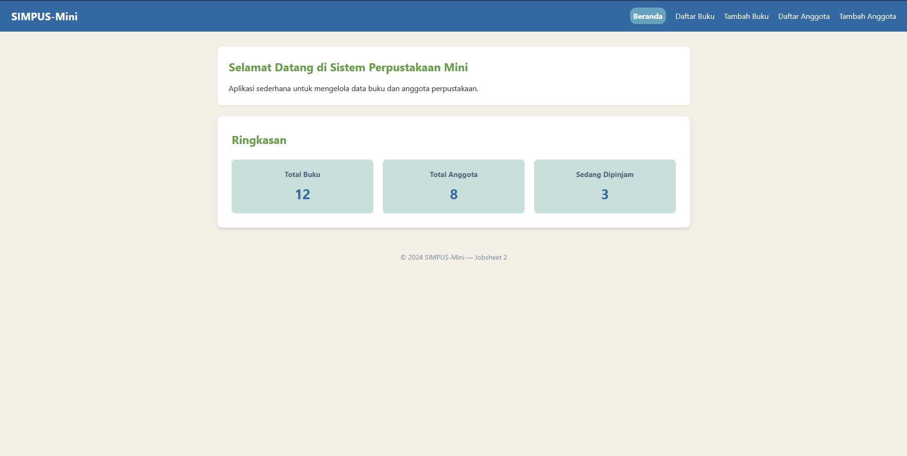
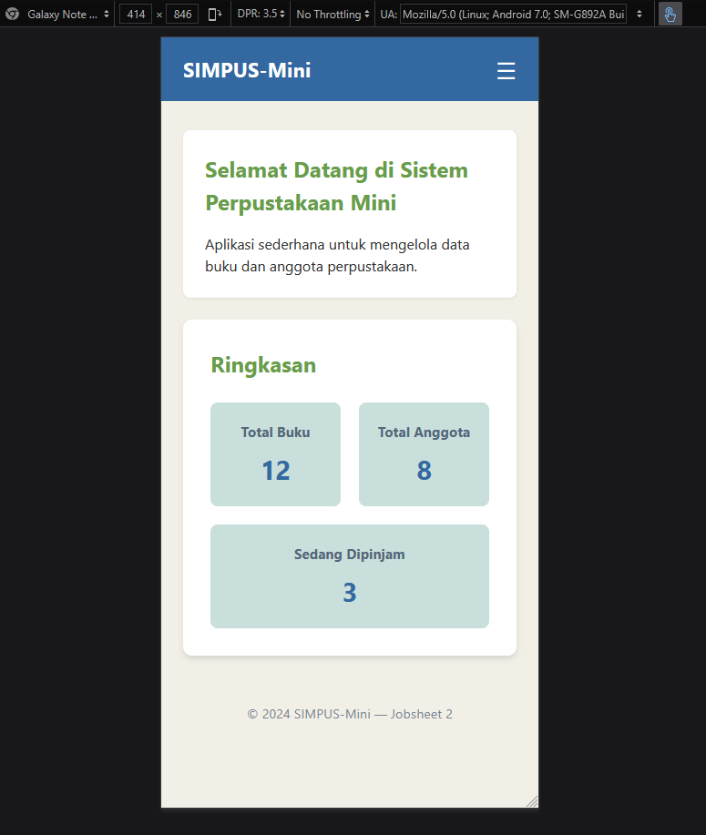
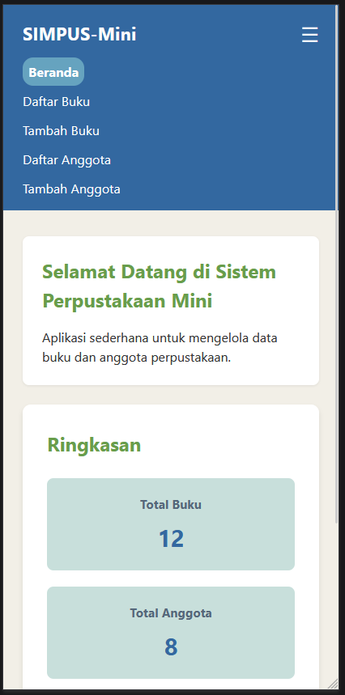
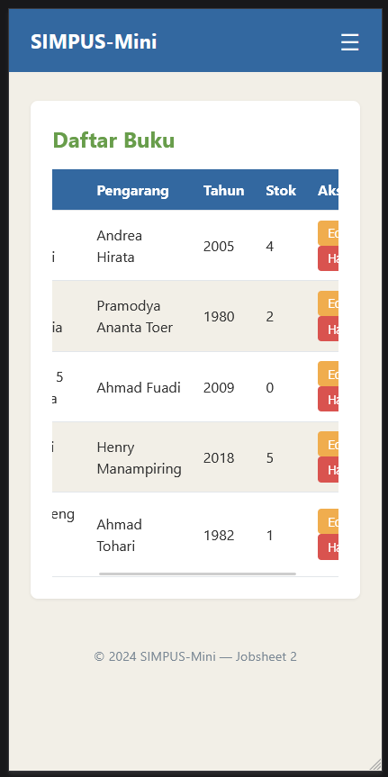

# Laporan Praktikum Jobsheet 3: Implementasi Responsive Design

## Identitas Praktikan
| Keterangan | Isi |
| :--- | :--- |
| Nama | Marvelino Husca |
| Kelas | TI 1H |
| NIM | 254107020184 |
| No Absen | 14 |
| Program Studi | D4 Teknik Informatika |

---

## 1. Penjelasan Singkat
Praktikum ini berfokus pada implementasi Responsive Design dimana website akan mengikuti lebar tampilan device pengguna. Ada tiga tampilan yang akan diatur pada website ini yaitu tampilan mobile, tablet dan desktop. 

## 2. Screenshot hasil per halaman

* **Tampilan Desktop vs Mobile**
  Tampilan navbar home yang awalnya menyamping menjadi menurun ke bawah dengan adanya ikon garis tiga (hamburger) pada Mobile. Lalu grid ringkasan yang ditengah akan menurun vertikal menjadi satu kolom saja

  
  

* **Implementasi Hamburger Menu**
  Menu hamburger akan muncul di halaman mobile dan ketika ditekan akan muncul navbar dalam posisi vertikal

  

* **Halaman Daftar Buku & Anggota (Tabel Responsif)**
  Tampilan tabel yang dapat di-scroll secara horizontal di dalam bungkusannya pada layar kecil

  

## 3. Latihan Tambahan
**Penyesuaian *Breakpoint* Responsif:** 
   Menetapkan titik henti (*breakpoint*) utama di angka `768px` (untuk transisi tata letak tablet/mobile) dan `480px` (khusus *smartphone* kecil). Penempatan kode *Media Query* diurutkan dari resolusi terbesar ke terkecil agar tidak terjadi tabrakan logika spesifisitas CSS.
   
**Penempatan Tombol Submit Dinamis:** 
   Menerapkan trik selektor spesifik `form > *:last-child { grid-column: 1 / -1; }`. Perintah ini memaksa elemen terakhir di dalam form (tombol "Simpan") untuk selalu mengambil satu baris penuh dari ujung kiri ke kanan, sehingga posisinya selalu rapi di bawah *input* apa pun.