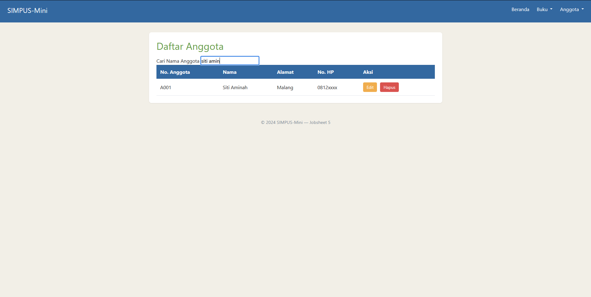
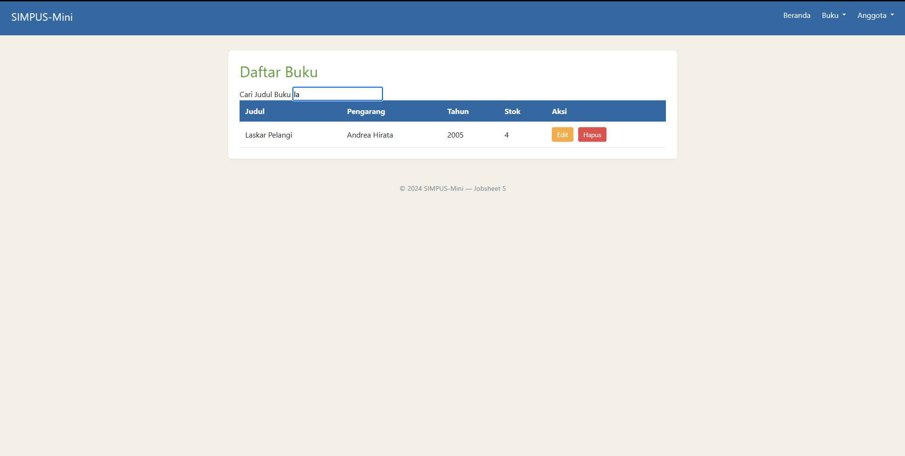
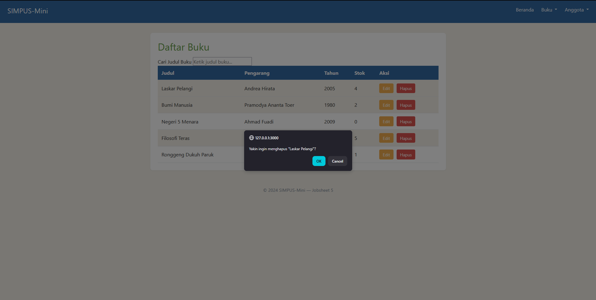
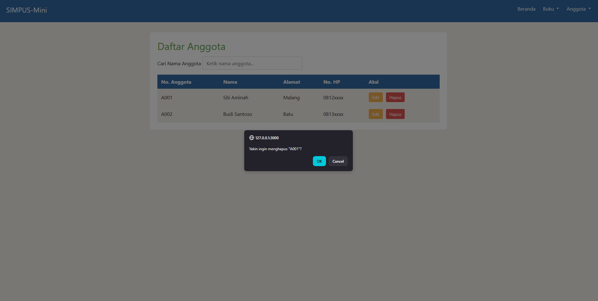
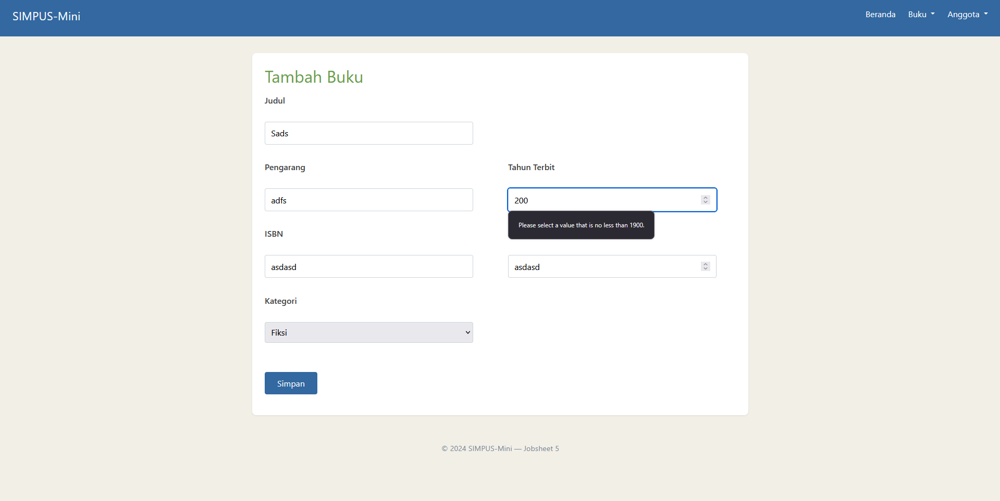
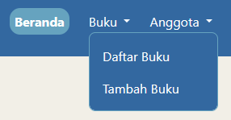
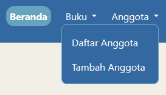

# Laporan Praktikum Jobsheet 5: JavaScript DOM & Event

## Identitas Praktikan
| Keterangan | Isi |
| :--- | :--- |
| Nama | Marvelino Husca |
| Kelas | TI 2D |
| NIM | 254107020184 |
| No Absen | 14 |
| Program Studi | D4 Teknik Informatika |

---

## 1. Penjelasan Singkat
Implementasi JavaScript dasar dengan menggunakan Bootstrap untuk menambahkan interaktivitas pada halaman web.

## 2. Screenshot hasil per halaman

* **Tampilan Filter pada Halaman List Buku dan Anggota**
  
  

  

* **Tampilan Hapus pada Halaman List Buku Anggota**

  
  

* **Validasi input pada form**
  
  

## 3. Latihan Tambahan
**Penyesuaian Navbar dengan Dropdown**
  Penambahan Dropdown untuk item buku dan anggota dengan masing-masing sub-item daftar dan tambah

  
  